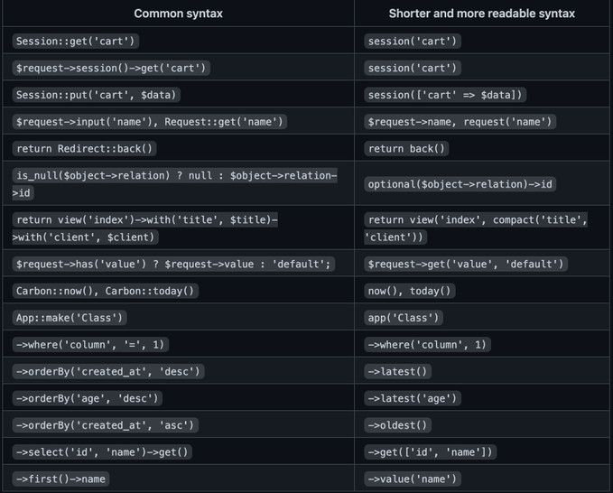

### storage link

```$ php artisan storage:link```  

### running The Scheduler Locally

```$ php artisan schedule:work```

### running The Queue Worker

```$ php artisan queue:work```

### install React

```$ npm install```  
```$ npm install react```  
```$ npm install react-dom```  
```$ npm install react-router-dom```  

[](#)
